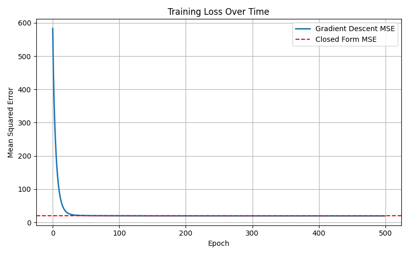

# Linear Regression from Scratch

This repository implements a multivariate linear regression model from first principles using only **NumPy** and **Matplotlib**. It includes both a closed-form analytical solution and a gradient descent optimization method, and is built for clarity, flexibility, and extensibility.

---

## Overview

This project provides a transparent and testable implementation of linear regression, showcasing numerical techniques and optimization logic without relying on external machine learning frameworks.

### Features

- Closed-form solution using QR decomposition (Modified Gram-Schmidt)
- Gradient descent with configurable learning rate, decay, and mini-batching
- Input validation and numerical diagnostics
- Feature normalization and inverse transformation
- Prediction and MSE evaluation
- Plotting of training loss

---

## Implementation Details

### Closed-Form Fit

- Uses QR decomposition via the Modified Gram-Schmidt method.
- Solves `Xw = y` by decomposing `X = QR` and solving `Rw = Qᵗy` with backward substitution.
- Includes checks for orthonormality (`QᵗQ ≈ I`), reconstruction (`QR ≈ X`), and triangularity.

### Gradient Descent Fit

- Supports full-batch and mini-batch training.
- Configurable learning rate, learning rate decay, and epochs.
- Tracks and optionally visualizes loss per epoch.

### Additional Utilities

- Manual backward substitution implementation.
- Feature normalization and denormalization of weights/bias.
- MSE computation and loss tracking.

---

## Repository Structure
```
├── main.py # Entry point: loads data, trains, evaluates
├── data/
│ └── Your Dataset
├── src/
│ ├── linear_regression.py # Main model class
│ └── utils/
│ ├── regression_math.py # QR, MSE, normalization logic
│ └── logger.py # Logging configuration
├── test/
│ └── test_linear_regression.py # Unit tests for model logic
├── requirements.txt
└── README.md
```
## Getting Started

### Installation

git clone https://github.com/your-username/linear-regression-from-scratch.git
cd linear-regression-from-scratch
python -m venv .venv
source .venv/bin/activate       # Windows: .venv\Scripts\activate
pip install -r requirements.txt

### Running the Model

python main.py

Loads Data
Trains models using both closed-form and gradient descent

Computes and logs MSE

Optionally plots training loss

### Running Tests

python -m test.test_linear_regression

### Example Output

Closed Form Normalized MSE: 0.0333
Gradient Descent Normalized MSE: 0.0334
Max Prediction Difference: 0.21

Closed form result:


Gradient descent result:


Loss:



## MIT License

Copyright (c) [2025] [Steven Doria]

Permission is hereby granted, free of charge, to any person obtaining a copy
of this software and associated documentation files (the "Software"), to deal
in the Software without restriction, including without limitation the rights
to use, copy, modify, merge, publish, distribute, sublicense, and/or sell
copies of the Software, and to permit persons to whom the Software is
furnished to do so, subject to the following conditions:

The above copyright notice and this permission notice shall be included in all
copies or substantial portions of the Software.

THE SOFTWARE IS PROVIDED "AS IS", WITHOUT WARRANTY OF ANY KIND, EXPRESS OR
IMPLIED, INCLUDING BUT NOT LIMITED TO THE WARRANTIES OF MERCHANTABILITY,
FITNESS FOR A PARTICULAR PURPOSE AND NONINFRINGEMENT. IN NO EVENT SHALL THE
AUTHORS OR COPYRIGHT HOLDERS BE LIABLE FOR ANY CLAIM, DAMAGES OR OTHER
LIABILITY, WHETHER IN AN ACTION OF CONTRACT, TORT OR OTHERWISE, ARISING FROM,
OUT OF OR IN CONNECTION WITH THE SOFTWARE OR THE USE OR OTHER DEALINGS IN THE
SOFTWARE.
